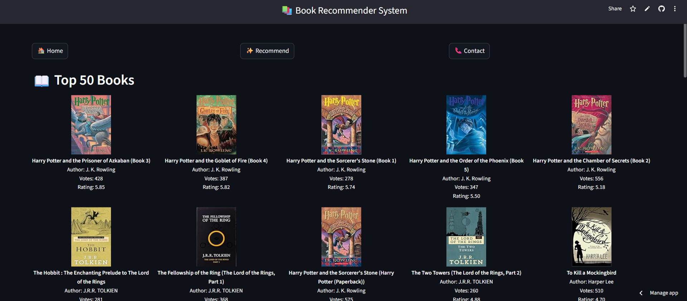

# 📚 Book Recommender System

A personalized **Book Recommender Web App** built using **Streamlit** and powered by a **collaborative filtering model**. It recommends books based on what similar users have liked, and also displays the top 50 most popular books based on average rating and vote count.

👉 **Try the app here**: [https://bookrecommendersystem-hkrgvy42xwtruiw9siq5b9.streamlit.app/](https://bookrecommendersystem-hkrgvy42xwtruiw9siq5b9.streamlit.app/)

---

### ✅ Features
- Recommends 5 similar books based on user selection  
- Displays top 50 most popular books (by average rating and number of votes)  
- Integrated book cover images for better UX  
- Clean and responsive layout with navigation buttons  
- Built using Streamlit and deployable on Streamlit Cloud  

---

### 🧠 How It Works
- **Collaborative Filtering** is used to recommend books similar to the one selected by the user.  
- The app uses **cosine similarity** on a pivot table of users × books (from ratings).  
- Data is processed and saved in `.pkl` files using `pickle` for faster loading in the app.  

---

### 🗂️ Project Structure

book-recommender/  
├── app.py                  → Streamlit app  
├── app.png                 → Screenshot for README  
├── books.csv               → Book metadata  
├── ratings.csv             → User ratings  
├── users.csv               → User info  
├── pt.pkl                  → Pivot table  
├── books.pkl               → Books metadata  
├── popular_df.pkl          → Top books dataframe  
├── similarity_scores.pkl   → Similarity matrix  
├── requirements.txt        → Required packages  
└── README.md               → Project documentation  

---

### 🧪 Tech Stack
- Python  
- Streamlit (Frontend & Backend UI)  
- Pandas, NumPy (Data Processing)  
- Pickle (Model/Data Persistence)  

---

### 🛠️ Setup Instructions (Run Locally)

1. Clone the repository  
git clone https://github.com/yourusername/book-recommender.git
cd book-recommender

2. Install the dependencies  
    pip install -r requirements.txt

3. Run the Streamlit app  

📌 **Ensure all `.pkl` and dataset `.csv` files are in the same folder as `app.py`.**

---

### 📸 App Screenshot

---

### 📞 Contact

- 📧 Email: gufrankhankab123@gmail.com  
- 📱 Phone: +91-8210783123

---
